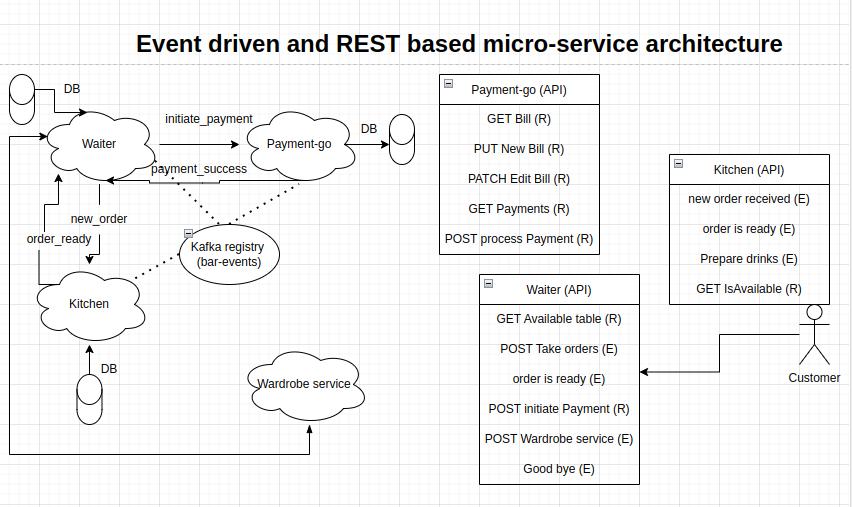
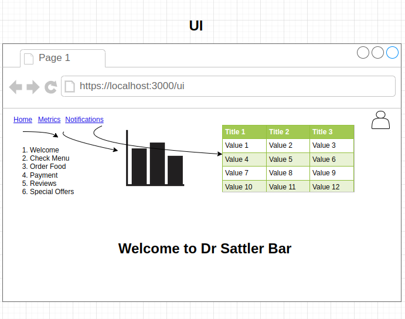

# dr-sattlers-bar
Microservices for serving cocktails

System Design is in progress ...

Made decisions:
React UI with Semantic UI, Redux-thunk
Spring boot and go microservices
Junit test cases
Ci/cd
Kafka event driven design
prometheus grafana
H2 or postgres DB

## Ui
This is the web interface. Following APIs are available:
1) Read menu (Get menu/cocktails) (Get menu/cocktailid) --> waiter
2) Order (post order/cocktailid) --> waiter
3) Check order status (get status/cocktailid) --> kitchen
4) GraphQl isAlcoholic? --> waiter--> kitchen
5) Pay (Post pay/billid) --> waiter --> payment-go

6) Metrics (admin)
7) Notifications (admin)

Error handling

### Routes
bar, metrics, notifications

## Backend
Some microservices written in node js, some in Java and some in python/go?

### Waiter microservice
It is written in Java, REST APIs for taking order, serving food and initiating payment. TODO enable kafka based event driven design
### Payment-go microservice
It handles payment and bill REST methods, written in go. TO add kafka and enable event driven design

## Events

Order placed
order ready
payment received
payment failed

https://www.confluent.io/blog/spring-for-apache-kafka-deep-dive-part-2-apache-kafka-spring-cloud-stream/

https://www.confluent.io/blog/spring-for-apache-kafka-deep-dive-part-1-error-handling-message-conversion-transaction-support/

## List of microservices

## Actors
https://github.com/topics/actor-model
We are not implementing actor model, because our usecase does not need it yet.

## Dockerize
Each of the backend microservices needs to be Dockerized separately, kafka, database, ui needs to be Dockerized as well.

## Security
### Oauth based
Oauth based spring security based APIs are a thing!

## Achieved goals
- Performed a Redux based oauth flow
- Waiter microservices offering REST APIs
- Payment-go microservices offering REST APIs

