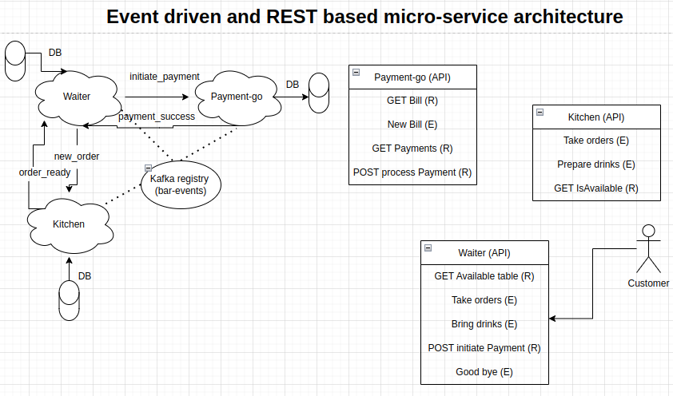

# dr-sattlers-bar
Microservices for serving cocktails

System Design is in progress:

## Ui
This is the web interface. Following APIs are available:
1) Read menu (Get menu/cocktails) (Get menu/cocktailid)
2) Order (post order/cocktailid)
3) Check order status (get status/cocktailid)
4) GraphQl isAlcoholic?
5) Pay (Post pay/billid)

6) Metrics (admin)
7) Notifications (admin)

Error handling

### Routes
bar, metrics, notifications

## Backend
Some microservices written in node js, some in Java and some in python/go?

## Events

Order placed
order ready
payment received
payment failed

https://www.confluent.io/blog/spring-for-apache-kafka-deep-dive-part-2-apache-kafka-spring-cloud-stream/

https://www.confluent.io/blog/spring-for-apache-kafka-deep-dive-part-1-error-handling-message-conversion-transaction-support/

## List of microservices

## Actors
https://github.com/topics/actor-model

## Dockerize

## Keycloak

docker run -p 8080:8080 -e KEYCLOAK_ADMIN=admin -e KEYCLOAK_ADMIN_PASSWORD=admin quay.io/keycloak/keycloak:19.0.2 start-dev

https://www.keycloak.org/getting-started/getting-started-docker

https://blog.logrocket.com/implement-keycloak-authentication-react/

Later on integration with Samba/openldap ?

https://www.talkingquickly.co.uk/keycloak-and-openldap-on-kubernetes

https://cagline.medium.com/authenticate-and-authorize-react-routes-component-with-keycloak-666e85662636

https://github.com/v-ladynev/keycloak-nodejs-example

TO DO:
Login page and oauth
Routing
roll based access to tabs

The example that i was following turns out to be a bust. New approach, from the udemy course will implement
React Routing and /bar /metrics /notifications

It seems most of the keycloak react library on top of router-dom are based on the version v5. So downgraded to react 16.14.0 and react-router 5.2.0

2022-10-08 01:05:02,388 WARN  [org.keycloak.events] (executor-thread-182) type=CODE_TO_TOKEN_ERROR, realmId=b1d2aa06-1159-4ef2-9944-87c269715c03, clientId=sattlers, userId=null, ipAddress=172.17.0.1, error=invalid_client_credentials, grant_type=authorization_code

this is the error, i might need to focus on microservices instead

TO do (11 Oct)
craeted new branch for trying different route than keycloak

