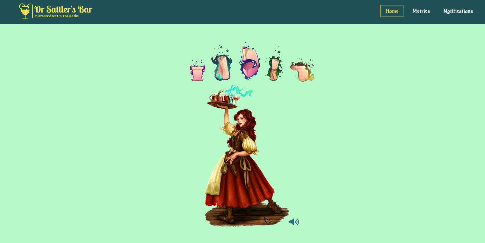

# dr-sattlers-bar
Microservices for serving cocktails

System Design is in progress ...

Made decisions:
React UI with Semantic UI, Redux-thunk
Spring boot and go microservices
Junit test cases
Ci/cd
Kafka event driven design
prometheus grafana
H2 or postgres DB

## Ui
This is the web interface. Following APIs are available:
1) Read menu (Get menu/cocktails) (Get menu/) --> direct database
2) Order (post order/cocktailid) --> waiter
3) Check order status (get status/cocktailid) --> kitchen
4) GraphQl isAlcoholic? --> waiter--> kitchen
5) Pay (Post pay/billid) --> waiter --> payment-go

6) Metrics (admin)
7) Notifications (admin)

Error handling

### Current status:

### Routes
Home, Metrics, Notifications

### Notifications flow
backend -> Notifications via kafka msg bus -> Kafka-broker(Dockerized) <- JS or java endpoint with kafka consumer that exposes the selected notifications via an Api -> redux-thunk -> react UI

### Metrics flow
No clue right now :D grafana and prometheus integration surely. Might even show some Jmeter performance data as metrics. wip

## Backend
Some microservices written in node js, some in Java and some in python/go?

## List of microservices

### Waiter microservice
It is written in Java, REST APIs for taking order, serving food and initiating payment. TODO enable kafka based event driven design

- Get Menu: In this functionality the user can get the static menu from the database directly and display. If no database availble then show no menu to display. ui -> database

- Find Table : This functionality can be triggered from the UI. Internally it creates a GET call via Waiter microservice to get a available table. Perhaps scope in the future for a "waiting system" using event driven table-got-free notification. 
  UI -> GET call to waiter -> Database query. Provide the first available table.
  (Future Improvement): Show a image and a available table, after choosing book that table. UI-> POST method via waiter
  
- Place Order : User or Waiter can place an order for a tableId. Both cases event driven implementation. Kafka topic published to kitchen -> order-recieved topic, paylod, tableid and items and quantity.
- Order status : ui -> Kitchen microservice REST GET call based on table status. params Table ID, returns status of all the order based on database record. ui -> Kitchen -> Database
- Pay Bill : REST POST call to go-payment microservice via Waiter microservice. If not available ask for cash :D ui -> payment-go -> database

 First populate all the table ids in a dropdown
  -Then user selects a tableId (where currently sitting)
  -Based on the tableid the total bill is populated
  -User proceeds to select payment method
  -Add tip functionality (Future scope)
  -Make Payment 
  -Integrate Stripe.mock or paypal sandbox for processing the payment (Future scope) 

TODO - Swagger API doc
https://smartbear.com/news/news-releases/swaggerhub-now-supports-event-driven-asyncapi-spec/

### Payment-go microservice
It handles payment and bill REST methods, written in go. TO add kafka and enable event driven design

## Events

Order placed
order ready
payment received
payment failed

https://www.confluent.io/blog/spring-for-apache-kafka-deep-dive-part-2-apache-kafka-spring-cloud-stream/

https://www.confluent.io/blog/spring-for-apache-kafka-deep-dive-part-1-error-handling-message-conversion-transaction-support/

## Actors
https://github.com/topics/actor-model
We are not implementing actor model, because our usecase does not need it yet.

## Dockerize
Each of the backend microservices needs to be Dockerized separately, kafka, database, ui needs to be Dockerized as well.

## Security
### Oauth based
Oauth based spring security based APIs are a thing!

## Achieved goals
- Performed a Redux based oauth flow (Right now deactivated)
- Waiter microservices offering REST APIs
- Payment-go microservices offering REST APIs
- UI welcoming functionality and skeleton look and feel
- Redesigned the frontend module to improve the design based on containerization needs

## This is put on hold until further notice, for other goals! 

