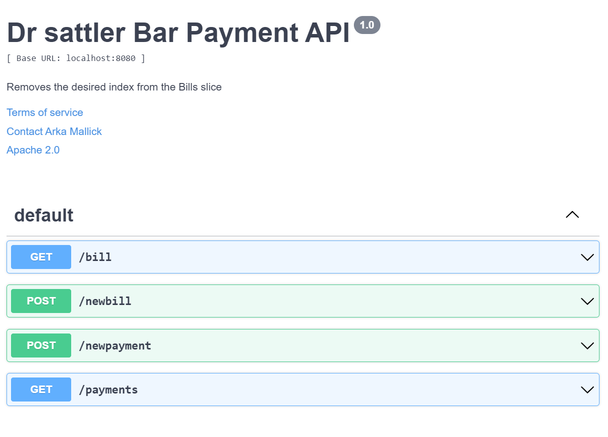

# Introduction
This is a REST API written in GO and GIN. The APIs are annotated and Swaggo was used to generate swagger contracts. This project supports REST based apis for billing and payment



## Documentation 
Swaggo is used, it helps generate swagger definition from Annotated GO Apis directly.
### Repository:
https://github.com/swaggo/swag

### Install if required
```go install github.com/swaggo/swag/cmd/swag@latest```
### To generate documentation
```swag init```

this would generated docs/docs.go, docs/swagger.json and docs/swagger.yaml

Go to https://editor.swagger.io/
paste the docs/swagger.yml to visualize the current api definitions, generated using swaggo, based on YOUR annotations of the API

## Steps to run
<pre>
go build
go run main.go 
</pre>

### Dockerize
<pre>
docker build -t payment-go-app .
docker run -p 8085:8085 payment-go-app
</pre>

## Dev notes
- curl http://localhost:8085/ping you can curl to a rest api to check if its running...
- netstat -an | grep 8085 --> Tocheck if there is any socker listening to that port 8085 
- Inside the main.go it was like this, router.Run("localhost:" + port) <-- Problem with 'localhost' when you connect via docker> Was getting connection refused!